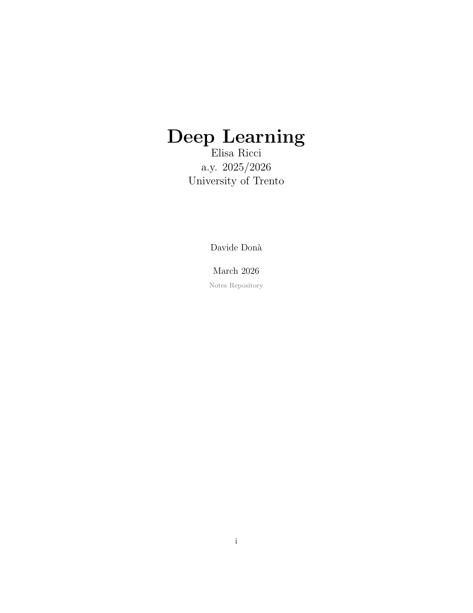

# Deep Learning Notes
A detailed collection of LaTeX-based lecture notes for the Deep Learning course at the University of Trento, academic year 2025/2026, instructed by Prof. Elisa Ricci.

    
     
    <a href="main.pdf" style="display: block; margin-top: 10px; font-size: 15px; font-weight: bold; color: #007acc;">
    Download the PDF notes</a>

---

## Topics Covered

| Section | Description |
|---|---|
| Machine Learning Recap | Learning paradigms, generalization, over/underfitting |
| Feedforward Neural Networks | Perceptron lineage, cost/output/activation functions, architecture |
| Optimization | Gradient descent variants, momentum, adaptive learning rates, batch normalization |
| Backpropagation | Chain rule, single neuron and general case derivations |
| Regularization | Model capacity, weight decay, dropout, and other overfitting countermeasures |
| Convolutional Neural Networks | Convolution, classic architectures (LeNet, AlexNet, GoogLeNet) |
| Expanding CNNs | Beyond classification |
| Recurrent Neural Networks | Vanilla RNN, LSTM, GRU, sequence configurations |
| Sequence Models | Sequence modelling |
| CLIP | Contrastive language–image pretraining |

The notes are organized under `chapters/<nn-topic>/`, each folder holding its `index.tex`, its TikZ sources (`tikz/`), and its images (`media/`).

---

##  Contributing

Contributions are welcome! Here's how you can help:

###  Issues
- Found a **typo**, a **wrong formula**, or a **missing topic**? [Open an issue](../../issues/new).
- Please include the **section name** and **page number** (if applicable).

###  Pull Requests
1. **Fork** this repository.
2. Create a new branch: `git checkout -b fix/your-description`.
3. Make your changes (edit the `.tex` files under `chapters/`).
4. Make sure the project **compiles without errors**: `latexmk -pdf main.tex`.
5. **Commit** with a descriptive message and **push** your branch.
6. Open a **Pull Request** against `main`.

---

## License

This project is intended for educational purposes. Feel free to use and share the notes with proper attribution.